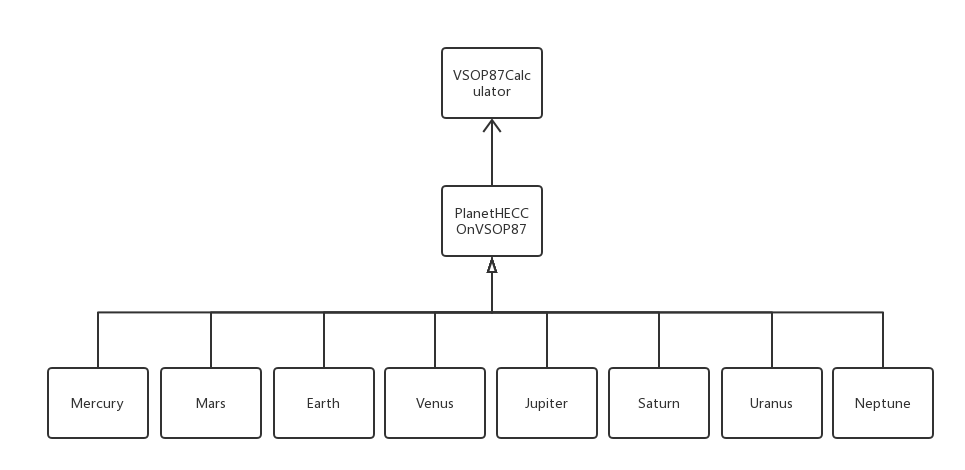

# SolarPlanetsHECC

[](#) [](https://www.npmjs.com/package/@behaver/solar-planets-hecc) [](#)

## 简介

SolarPlanetsHECC 是计算太阳系行星的日心黄道坐标的组件库，这其中包含了 *Mercury*、*Mars*、*Earth*、*Venus*、*Jupiter*、*Saturn*、*Uranus*、*Neptune* 这八个太阳系行星的日心黄道坐标计算组件。

核心组件 VSOP87 计算器文档，另见：[VSOP87Calculator](./doc/VSOP87Calculator.md)

## 安装

通过 npm 安装，在你的 node 项目目录下执行：

`npm install @behaver/solar-planets-hecc`

安装完成后，调用即可：

`const { Mercury, Mars, Earth } = require('@behaver/solar-planets-hecc');`

## 用例

```js
const { Venus } = require('@behaver/solar-planets-hecc');
const { JDateRepository } = require('@behaver/jdate');

let jdr = new JDateRepository(2446896);
let venus = Venus(jdr);

// 获取金星日心黄经度数
let l = venus.l.getDegrees();

// 获取金星日心黄纬度数
let b = venus.b.getDegrees();

// 获取金星日心距离
let r = venus.r;

// 获取金星日心球坐标
let sc = venus.sc;
```

关于计算误差的设置：

```js
const { Venus } = require('@behaver/solar-planets-hecc');
const { JDateRepository } = require('@behaver/jdate');

let jdr = new JDateRepository(2446896);
let venus = Venus(jdr);

// 方法一：调整精度等级
venus.accuracy = 'low';

// 方法二：设置计算截断值数组
venus.setTruncation('b', [ 20, 10, 5, 3, 2, 1 ]);

// 方法三：
// 设置最大误差（瞬时）
venus.setMaxError('r', 0.000005);

// 设置平均最大误差
venus.setMaxError('r', 0.000005, 'mean');

// 设置安全最大误差
venus.setMaxError('r', 0.000005, 'safe');
```

## 类图



## API

`constructor(obTime, accuracy = 'normal')`

构造函数

* obTime 观测儒略时间
* accuracy 计算精度

`get l()`

获取 行星日心黄经值

`get b()`

获取 行星日心黄纬值

`get r()`

获取 行星日心距离

`get sc()`

获取 行星日心黄道球坐标

`get obTime()`

获取观测儒略时间

`set obTime(jdr)`

设定观测儒略时间

`get accuracy()`

获取计算精度

`set accuracy(level)`

设置计算精度

* levev 包括以下几个等级：low, normal, high, fine, complete。

精度等级和安全最大误差（单位：弧度 / AU）的对应关系：

low      0.00005 
normal   0.000005
high     0.0000005
fine     0.00000005
complete 0

此处不考虑 VSOP87 数据算法自身误差，实际误差要进行叠加。

`getTruncation(item)`

获取截断值数组

* item 计算项：l、b、r

`setTruncation(item, tNumsArray)`

设置截断值数组

* item 计算项：l、b、r
* tNumsArray 截断值数组

`setMaxError(item, value, mode = 'true')`

设置计算允许最大误差

通过此方法设置运算截断值相较于 `setTruncation(item, tNumsArray)` 和 `set accuracy(level)` 会产生额外的运算量，若为了缩小运算量而使用该方法，则不适于多次调用。

* item 计算项：l、b、r
* value 最大误差数值
* mode 计算模式: true(瞬时误差)、mean(平均误差)、safe(安全误差)

`getMaxError(item)`

获取最大误差

* item 计算项：l、b、r

## 许可证书

The MIT license.